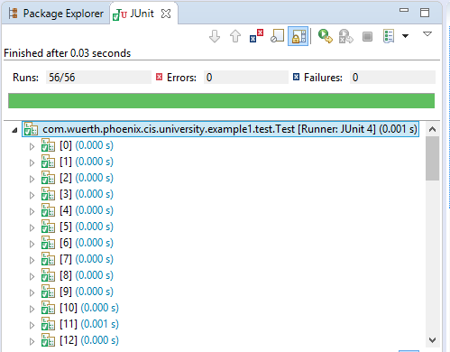

# Software Reliability and Testing 2017/2018
## Team Member
* Buse Eryilmaz
* Heider Jeffer
* Opaniyi Ayokunmi Tolulope
* Triando Damiri Burlian

# 1st Assignment - Reduce the number of combinations

## Test class
`src/com/wuerth/phoenix/cis/university/example1/test/Test.java`

## Dependency
JUnit4 and JRE System Library.

## Total combinations and reduction strategy
Total combinations was 56, which was generated automatically by `CombinationGenerator.Java`
`src/com/wuerth/phoenix/cis/university/example1/test/CombinationGenerator.Java`

Steps of `CombinationGenerator.java` to reduce the combinations were:
* Read `Account.csv`
    * skipped 1st row (table header)
    * skipped 1st column because `getCode()` method from `Account.java` is not used as an valid criteria at `Example1Checker.java`
    * removed duplicates from 1819 rows to 23 rows

* Read `CRComponent.csv`
    * skipped 1st row (table header)
    * skipped 1st column because `getName()` method from `CRComponent.java` is not used as an valid criteria at `Example1Checker.java`
    * removed duplicates from 21 rows to 3 rows

* Read `ProfitCenter.csv`
    * skipped 1st row (table header)
    * skipped 1st column because `getName()` method from `ProfitCenter.java` is not used as an valid criteria at `Example1Checker.java`
    * removed duplicates from 78 rows to 2 rows

* Combined Account, CRComponent, and ProfitCenter from 23 x 3 x 2 to 138 rows
* Filtered valid combinations by passing object to `isValid()` method and wrote 56 combinations to `Combination.csv`
* Implemented unit test by using parameterized test and read reduced combinations at `Combination.csv`


### Combinations
```
accountCode,accountClass,accountType,isPartnerAllowed,pcName,isNotAllocated,crName,isNotAllocated,isVKAllowed,isSEANAllowed,external,dataScenarioType,partnerCode,currencyCode
Code,Logistics,,false,ProfitCenter,true,CRComponent,true,true,true,true,Actual,,
Code,AllocationFormula,,false,ProfitCenter,true,CRComponent,false,false,false,true,Actual,,
Code,AllocationFormula,,false,ProfitCenter,true,CRComponent,true,true,true,true,Actual,,
Code,AllocationFormula,,false,ProfitCenter,true,CRComponent,false,true,true,true,Actual,,
Code,AllocationFormula,,false,ProfitCenter,false,CRComponent,false,false,false,true,Actual,,
Code,AllocationFormula,,false,ProfitCenter,false,CRComponent,true,true,true,true,Actual,,
Code,AllocationFormula,,false,ProfitCenter,false,CRComponent,false,true,true,true,Actual,,
Code,BalanceSheet,,false,ProfitCenter,true,CRComponent,true,true,true,true,Actual,,
Code,BalanceSheet,,false,ProfitCenter,false,CRComponent,true,true,true,true,Actual,,
Code,BalanceSheet,AssetPartner,true,ProfitCenter,true,CRComponent,true,true,true,true,Actual,,
Code,BalanceSheet,AssetPartner,true,ProfitCenter,false,CRComponent,true,true,true,true,Actual,,
Code,BalanceSheet,,true,ProfitCenter,true,CRComponent,true,true,true,true,Actual,,
Code,BalanceSheet,,true,ProfitCenter,false,CRComponent,true,true,true,true,Actual,,
Code,SalesReporting,Customer,false,ProfitCenter,true,CRComponent,false,false,false,true,Actual,,
Code,SalesReporting,Customer,false,ProfitCenter,true,CRComponent,false,true,true,true,Actual,,
Code,SalesReporting,Customer,false,ProfitCenter,false,CRComponent,false,false,false,true,Actual,,
Code,SalesReporting,Customer,false,ProfitCenter,false,CRComponent,false,true,true,true,Actual,,
Code,SalesReporting,SpecialAnalyses,false,ProfitCenter,true,CRComponent,true,true,true,true,Actual,,
Code,SalesReporting,SpecialAnalysesNumOfInvoicingDays,false,ProfitCenter,true,CRComponent,false,false,false,true,Actual,,
Code,SalesReporting,SpecialAnalysesNumOfInvoicingDays,false,ProfitCenter,true,CRComponent,true,true,true,true,Actual,,
Code,SalesReporting,SpecialAnalysesNumOfInvoicingDays,false,ProfitCenter,true,CRComponent,false,true,true,true,Actual,,
Code,SalesReporting,SpecialAnalysesNumOfInvoicingDays,false,ProfitCenter,false,CRComponent,false,false,false,true,Actual,,
Code,SalesReporting,SpecialAnalysesNumOfInvoicingDays,false,ProfitCenter,false,CRComponent,true,true,true,true,Actual,,
Code,SalesReporting,SpecialAnalysesNumOfInvoicingDays,false,ProfitCenter,false,CRComponent,false,true,true,true,Actual,,
Code,SalesReporting,SML,false,ProfitCenter,true,CRComponent,false,false,false,true,Actual,,
Code,SalesReporting,SML,false,ProfitCenter,true,CRComponent,false,true,true,true,Actual,,
Code,SalesReporting,SML,false,ProfitCenter,false,CRComponent,false,false,false,true,Actual,,
Code,SalesReporting,SML,false,ProfitCenter,false,CRComponent,false,true,true,true,Actual,,
Code,SalesReporting,SMLGrossProfit,false,ProfitCenter,true,CRComponent,false,false,false,true,Actual,,
Code,SalesReporting,SMLGrossProfit,false,ProfitCenter,true,CRComponent,true,true,true,true,Actual,,
Code,SalesReporting,SMLGrossProfit,false,ProfitCenter,true,CRComponent,false,true,true,true,Actual,,
Code,SalesReporting,SMLGrossProfit,false,ProfitCenter,false,CRComponent,false,false,false,true,Actual,,
Code,SalesReporting,SMLGrossProfit,false,ProfitCenter,false,CRComponent,true,true,true,true,Actual,,
Code,SalesReporting,SMLGrossProfit,false,ProfitCenter,false,CRComponent,false,true,true,true,Actual,,
Code,SalesReporting,SMLPotential,false,ProfitCenter,true,CRComponent,false,false,false,true,Actual,,
Code,SalesReporting,SMLPotential,false,ProfitCenter,true,CRComponent,true,true,true,true,Actual,,
Code,SalesReporting,SMLPotential,false,ProfitCenter,true,CRComponent,false,true,true,true,Actual,,
Code,SalesReporting,SMLPotential,false,ProfitCenter,false,CRComponent,false,false,false,true,Actual,,
Code,SalesReporting,SMLPotential,false,ProfitCenter,false,CRComponent,true,true,true,true,Actual,,
Code,SalesReporting,SMLPotential,false,ProfitCenter,false,CRComponent,false,true,true,true,Actual,,
Code,SalesReporting,SEAN,false,ProfitCenter,true,CRComponent,true,true,true,true,Actual,,
Code,SalesReporting,SEAN,false,ProfitCenter,false,CRComponent,true,true,true,true,Actual,,
Code,SalesReporting,SpecialAnalysesServiceDegree,false,ProfitCenter,true,CRComponent,false,false,false,true,Actual,,
Code,SalesReporting,SpecialAnalysesServiceDegree,false,ProfitCenter,true,CRComponent,true,true,true,true,Actual,,
Code,SalesReporting,SpecialAnalysesServiceDegree,false,ProfitCenter,true,CRComponent,false,true,true,true,Actual,,
Code,SalesReporting,SpecialAnalysesServiceDegree,false,ProfitCenter,false,CRComponent,false,false,false,true,Actual,,
Code,SalesReporting,SpecialAnalysesServiceDegree,false,ProfitCenter,false,CRComponent,true,true,true,true,Actual,,
Code,SalesReporting,SpecialAnalysesServiceDegree,false,ProfitCenter,false,CRComponent,false,true,true,true,Actual,,
Code,SalesReporting,Employees,false,ProfitCenter,true,CRComponent,true,true,true,true,Actual,,
Code,SalesReporting,Employees,false,ProfitCenter,false,CRComponent,true,true,true,true,Actual,,
Code,SalesReporting,VK,false,ProfitCenter,true,CRComponent,true,true,true,true,Actual,,
Code,PLStatement,PrognosisNumOfAdmDecember,false,ProfitCenter,true,CRComponent,true,true,true,true,Actual,,
Code,PLStatement,PrognosisNumOfAdmMPlus1,false,ProfitCenter,true,CRComponent,true,true,true,true,Actual,,
Code,PLStatement,PrognosisNumOfAdmMPlus2,false,ProfitCenter,true,CRComponent,true,true,true,true,Actual,,
Code,PLStatement,PrognosisOperatingResult,false,ProfitCenter,true,CRComponent,true,true,true,true,Actual,,
Code,PLStatement,PrognosisSales,false,ProfitCenter,true,CRComponent,true,true,true,true,Actual,,
```

## New CSV file
data\Combinations.csv